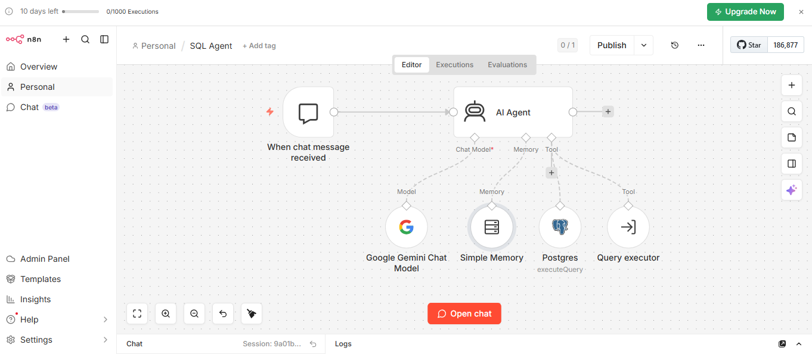
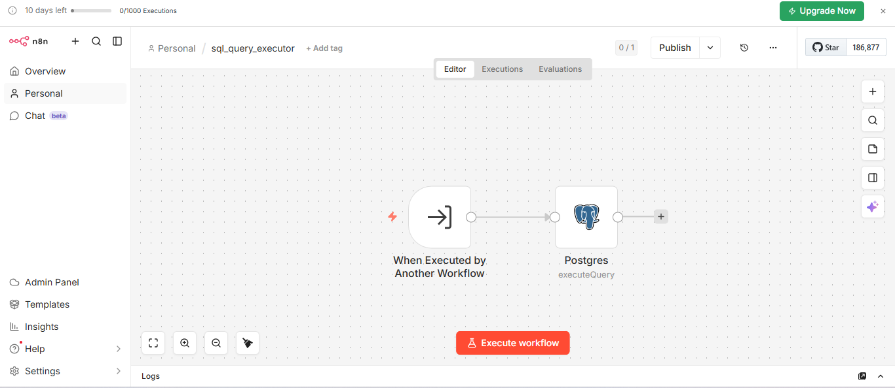

# SQL Agent — Chat with Your Database (n8n)

An AI agent built in n8n that lets users ask questions in plain English (e.g. *"Show me sales from Mumbai last month"*) and get real answers straight from a Postgres database — no SQL required.

## How It Works

```
Chat Trigger → AI Agent (Gemini + Memory) → Schema Tool + Query Executor → Postgres → Answer
```

1. User sends a natural language question via chat.
2. The **AI Agent** (powered by Gemini, with conversation memory) interprets the question.
3. It uses a **schema tool** to check available tables/columns (via Supabase's Postgres database) before writing a query.
4. It calls a **Query Executor** sub-workflow to run the generated SQL against the Supabase Postgres database.
5. Results are returned to the user in chat. If the question is unclear, the agent asks a follow-up; if no relevant data exists, it says so and offers what it *can* help with.

## Workflows

- **SQL Agent** — main workflow: chat trigger, AI agent, Gemini model, memory, schema tool, query executor tool.
  
- **sql_query_executor** — sub-workflow that receives a SQL string and executes it against the database.
   

## Tools

- **n8n** – workflow orchestration
- **Google Gemini** – LLM powering the agent
- **Supabase (Postgres)** – database + schema introspection

## Outcome

Non-technical users can query the database conversationally, get instant answers, and no longer depend on someone writing SQL for them.
